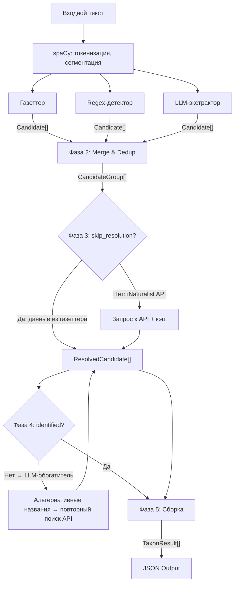
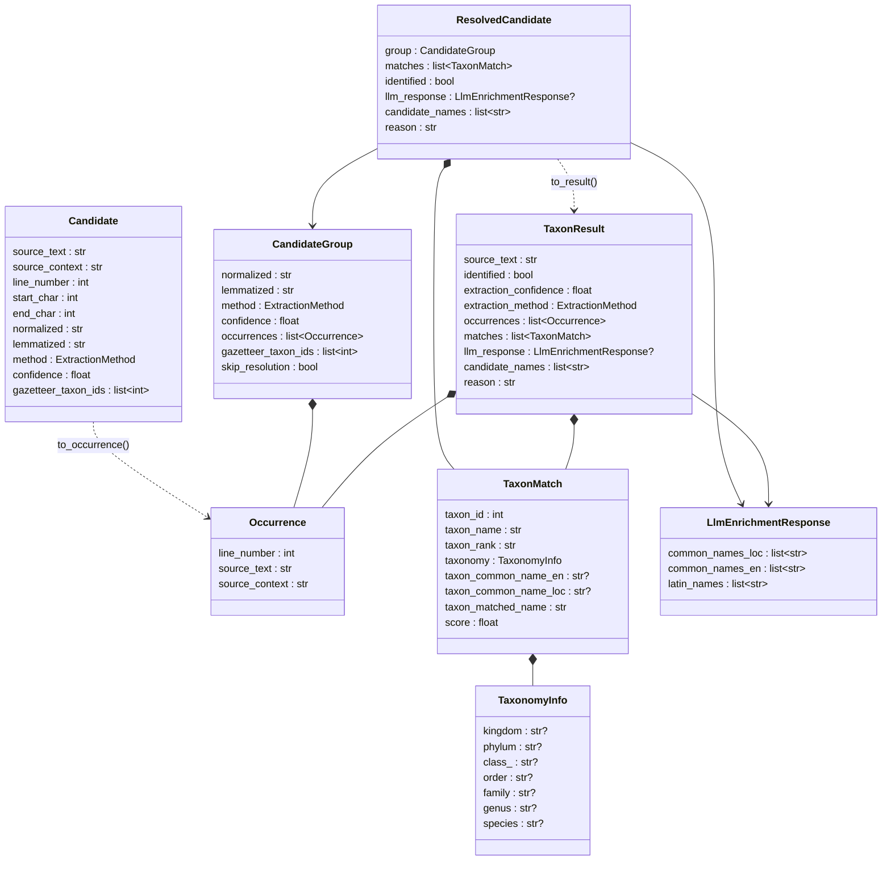

# Модели данных

Описание внутренних структур данных, которые перетекают между фазами пайплайна.
Реализуются как Python dataclasses в `taxonfinder/models.py` и `taxonfinder/events.py`.

Общая архитектура — в [projectdescription.md](../projectdescription.md),
алгоритмы — в [docs/processing.md](processing.md),
форматы вывода — в [docs/data-and-cli.md](data-and-cli.md).

## Поток данных через пайплайн



---

## ExtractionMethod

Метод, которым был извлечён кандидат.

| Значение | Описание |
|----------|----------|
| `"gazetteer"` | Найден по совпадению с газеттером (PhraseMatcher) |
| `"latin_regex"` | Найден regex-детектором латинских биномиалов |
| `"llm"` | Извлечён LLM-экстрактором |

В Python: `Literal["gazetteer", "latin_regex", "llm"]`.

---

## Модели извлечения (Фазы 1–2)

### Candidate

Один потенциальный таксон, найденный экстрактором в тексте.
Создаётся на Фазе 1 каждым экстрактором. На Фазе 2 кандидаты объединяются
в группы (`CandidateGroup`).

| Поле | Тип | Описание |
|------|-----|----------|
| `source_text` | `str` | Фрагмент текста в оригинальной форме, как он встречается в книге. Без нормализации — именно то, что стоит в тексте (например, «лип», «Tilia cordata»). |
| `source_context` | `str` | Полное предложение, в котором встречен фрагмент. Определяется через spaCy `doc.sents`. Нужен для вывода и для передачи в LLM-обогатитель как контекст. |
| `line_number` | `int` | Номер строки (1-based) во входном файле, где начинается совпадение. |
| `start_char` | `int` | Смещение от начала текста (в символах) — начало совпавшего фрагмента. Используется для обнаружения перекрытий между кандидатами на Фазе 2. |
| `end_char` | `int` | Смещение от начала текста — конец совпавшего фрагмента. |
| `normalized` | `str` | Нормализованная форма: lowercase + замена ё→е. Используется для группировки и поиска в iNaturalist. |
| `lemmatized` | `str` | Лемматизированная форма (каждое слово лемматизировано через pymorphy3, затем lowercase + ё→е). Это **ключ группировки** на Фазе 2: кандидаты с одинаковым `lemmatized` объединяются. |
| `method` | `ExtractionMethod` | Какой экстрактор нашёл этого кандидата. |
| `confidence` | `float` | Уверенность в том, что это название таксона (0.0–1.0). Вычисляется по модели confidence (см. [processing.md](processing.md#модель-extraction_confidence)). |
| `gazetteer_taxon_ids` | `list[int]` | Список `taxon_id` из газеттера, на которые маппится это название. Пуст для кандидатов из regex и LLM. Используется для: (1) расчёта confidence (фактор неоднозначности), (2) определения `skip_resolution` на Фазе 3. |

### Occurrence

Одно конкретное место в тексте, где встречен таксон. Облегчённая запись,
создаваемая из `Candidate` при группировке. Используется в Фазе 5 для сборки
вывода и в итоговом JSON (поле `occurrences`).

| Поле | Тип | Описание |
|------|-----|----------|
| `line_number` | `int` | Номер строки (1-based) во входном файле. |
| `source_text` | `str` | Фрагмент текста в оригинальной форме (как в книге). |
| `source_context` | `str` | Предложение, содержащее этот фрагмент. |

### CandidateGroup

Группа кандидатов, объединённых по общей лемме. Создаётся на Фазе 2.
Представляет один «уникальный кандидат», который будет разрешён через iNaturalist
или газеттер ровно один раз. Содержит все вхождения этого кандидата в тексте.

| Поле | Тип | Описание |
|------|-----|----------|
| `normalized` | `str` | Нормализованная форма (из наилучшего кандидата группы). Используется как поисковый запрос к iNaturalist API. |
| `lemmatized` | `str` | Лемматизированная форма — ключ, по которому кандидаты были сгруппированы. |
| `method` | `ExtractionMethod` | Метод извлечения с наивысшим приоритетом в группе (газеттер > regex > LLM). Если один и тот же фрагмент найден и газеттером, и regex — берётся газеттер. |
| `confidence` | `float` | Наивысшая confidence среди кандидатов группы. |
| `occurrences` | `list[Occurrence]` | Все места в тексте, где встречен этот кандидат (может быть сотни). |
| `gazetteer_taxon_ids` | `list[int]` | Объединение `gazetteer_taxon_ids` из всех кандидатов группы. При группировке по лемме объединение выполняется только если множества `gazetteer_taxon_ids` пересекаются (или хотя бы одно пусто). Это предотвращает объединение омонимов, маппящихся на разные таксоны. |
| `skip_resolution` | `bool` | `True`, если обращение к iNaturalist API **не требуется**: кандидат найден газеттером, и SQLite-база содержит все поля, необходимые для вывода (`taxon_id`, `taxon_name`, `taxon_rank`, `taxon_common_name`). Устанавливается при создании группы на основе проверки данных газеттера. |

---

## Модели разрешения (Фазы 3–4)

### TaxonomyInfo

Таксономическая иерархия таксона. Содержит информацию о принадлежности к основным
таксономическим рангам. Поля заполняются на основе `ancestry` из ответа iNaturalist API.

При частичном определении (например, «утки» → Anatidae) заполняются только уровни
до определённого ранга включительно, остальные остаются `None`.

| Поле | Тип | Описание |
|------|-----|----------|
| `kingdom` | `str \| None` | Царство (напр. «Animalia», «Plantae»). |
| `phylum` | `str \| None` | Тип/Отдел (напр. «Chordata», «Magnoliophyta»). |
| `class_` | `str \| None` | Класс (напр. «Aves», «Mammalia»). Имя `class_`, т.к. `class` зарезервировано в Python. При сериализации в JSON поле сериализуется как `"class"` (без подчёркивания). Сериализатор (`to_dict()` или аналог) должен выполнять маппинг `class_` → `class`. |
| `order` | `str \| None` | Отряд/Порядок (напр. «Passeriformes», «Rosales»). |
| `family` | `str \| None` | Семейство (напр. «Anatidae», «Rosaceae»). |
| `genus` | `str \| None` | Род (напр. «Tilia», «Quercus»). |
| `species` | `str \| None` | Вид. Совпадает с `taxon_name` для видового ранга. |

### TaxonMatch

Один результат поиска в iNaturalist (или в газеттере для пропущенных кандидатов).
Соответствует одному элементу массива `matches` в JSON-выводе.

| Поле | Тип | Описание |
|------|-----|----------|
| `taxon_id` | `int` | Идентификатор таксона в iNaturalist. Главный ключ для ссылки на таксон. |
| `taxon_name` | `str` | Научное (латинское) название таксона (например, «Tilia», «Quercus robur»). |
| `taxon_rank` | `str` | Таксономический ранг: `"species"`, `"genus"`, `"family"` и т.д. |
| `taxonomy` | `TaxonomyInfo` | Полная таксономическая иерархия. Заполняется из `ancestry` ответа iNaturalist. |
| `taxon_common_name_en` | `str \| None` | Предпочитаемое английское народное название. Всегда загружается из iNaturalist для универсальности и портируемости. `None`, если недоступно. |
| `taxon_common_name_loc` | `str \| None` | Предпочитаемое народное название для locale из конфигурации (например, «Липа» для locale=ru). `None`, если iNaturalist не имеет common name для этого locale. |
| `taxon_matched_name` | `str` | Название, по которому был найден этот таксон. Может отличаться от `source_text` — например, если поиск шёл по лемме «липа», а source_text было «лип». |
| `score` | `float` | Релевантность. Для API-результатов — `score` из ответа iNaturalist. Для газеттерных результатов — синтетический score (1.0 для `is_preferred`, 0.5 для остальных). Используется для сортировки matches и доступен при отладке/API-режиме. |

### LlmEnrichmentResponse

Ответ LLM-обогатителя (Фаза 4). Содержит альтернативные названия, предложенные LLM
для кандидата, не разрешённого через iNaturalist. Соответствует полю `llm_response`
в JSON-выводе.

LLM-обогатитель может использовать другую модель и провайдера, чем LLM-экстрактор —
конфигурация задаётся в разделах `llm_extractor` и `llm_enricher` независимо.
Обогатитель работает с кандидатами от **всех** экстракторов (gazetteer, regex, LLM),
которые не удалось разрешить через iNaturalist.

| Поле | Тип | Описание |
|------|-----|----------|
| `common_names_loc` | `list[str]` | Народные названия на языке текста (locale из конфига), предложенные LLM. Каждое будет отправлено в iNaturalist для повторного поиска. |
| `common_names_en` | `list[str]` | Английские народные названия, предложенные LLM. Английские имена часто дают лучший recall в iNaturalist. |
| `latin_names` | `list[str]` | Латинские (научные) названия, предложенные LLM. Полезно, когда LLM распознаёт, что народное название соответствует конкретному виду. |

### ResolvedCandidate

Кандидат после разрешения через iNaturalist API или газеттер (Фаза 3),
возможно обогащённый через LLM (Фаза 4). Содержит всё необходимое для
формирования итогового `TaxonResult`.

При вызове LLM-обогатителя передаётся расширенный контекст (несколько предложений
вокруг вхождения), а не только `source_context`. Это улучшает качество обогащения
для коротких или неоднозначных предложений. Расширенный контекст вычисляется
из исходного текста по `start_char`/`end_char` и не хранится в модели.

| Поле | Тип | Описание |
|------|-----|----------|
| `group` | `CandidateGroup` | Исходная группа кандидатов (со всеми вхождениями). |
| `matches` | `list[TaxonMatch]` | Результаты поиска (до 5), отсортированные по убыванию `score`. Может быть пуст, если ни iNaturalist, ни газеттер не нашли совпадений. |
| `identified` | `bool` | Удалось ли однозначно определить таксон. Определяется по критериям из [processing.md](processing.md#критерии-identified): сравнение нормализованной и лемматизированной форм source_text с именами из matches. |
| `llm_response` | `LlmEnrichmentResponse \| None` | Ответ LLM-обогатителя, если кандидат прошёл через Фазу 4. `None`, если LLM не использовался (кандидат уже identified или обогатитель отключён). |
| `candidate_names` | `list[str]` | Все варианты названий, которые были опробованы при поиске: оригинальное, нормализованное, из LLM-обогатителя. Пустой список при `identified=True`. |
| `reason` | `str` | Диагностическое сообщение, генерируемое логикой разрешения. Пустая строка при `identified=True`. См. [Значения reason](#значения-reason). |

---

## Модель вывода (Фаза 5)

### TaxonResult

Итоговая запись об одном таксоне, готовая для сериализации в JSON.
Создаётся на Фазе 5 из `ResolvedCandidate`. Содержит все данные, необходимые
для обоих режимов вывода (дедуплицированного и полного).

В дедуплицированном режиме каждый `TaxonResult` становится одним JSON-объектом
с полем `count` и массивом `occurrences`.
В полном режиме (`--all-occurrences`) каждое вхождение из `occurrences`
разворачивается в отдельный JSON-объект.

| Поле | Тип | Описание |
|------|-----|----------|
| `source_text` | `str` | Каноническая форма названия таксона — `source_text` из первого вхождения. Используется как основное представление в выводе. |
| `identified` | `bool` | `true` или `false`. Boolean в Python и в JSON. |
| `extraction_confidence` | `float` | Confidence из `CandidateGroup` (наивысший в группе). |
| `extraction_method` | `ExtractionMethod` | Метод извлечения из `CandidateGroup` (наивысший приоритет). |
| `occurrences` | `list[Occurrence]` | Все места в тексте, где встречен этот таксон. `count` вычисляется как `len(occurrences)`. |
| `matches` | `list[TaxonMatch]` | Результаты из iNaturalist/газеттера (до 5). Формат элементов совпадает с JSON-схемой вывода. |
| `llm_response` | `LlmEnrichmentResponse \| None` | Ответ LLM-обогатителя. `None`, если LLM не использовался. |
| `candidate_names` | `list[str]` | Все опробованные варианты названий. Пустой список при `identified=true`. Всегда присутствует в JSON-выводе (без conditional requirements — это упрощает схему и парсинг). |
| `reason` | `str` | Диагностическое сообщение. Пустая строка при `identified=true`. Всегда присутствует в JSON-выводе. |

#### Значения reason

Поле `reason` генерируется логикой разрешения (Фазы 3–4) и принимает следующие значения:

| Значение | Когда устанавливается |
|----------|----------------------|
| `""` (пустая строка) | `identified=true` — таксон успешно определён. |
| `"No matches in iNaturalist"` | API не нашёл ни одного таксона по запросу. |
| `"Common name not matched"` | Matches найдены, но ни один `taxon_matched_name` не совпал с source_text (по normalized/lemmatized формам). |
| `"Multiple candidate taxa found"` | Несколько возможных matches с близким score, невозможно выбрать однозначно. |
| `"LLM returned invalid response"` | LLM-обогатитель вернул невалидный JSON после всех retry. |

---

## События пайплайна

Пайплайн — синхронный генератор, который yield'ит `PipelineEvent` по мере обработки.
События реализуются как dataclasses в `taxonfinder/events.py`.

### PipelineEvent

Union-тип всех событий:

```python
PipelineEvent = PhaseStarted | PhaseProgress | ResultReady | PipelineFinished
```

### PhaseStarted

Начало фазы обработки. Yield'ится один раз при входе в каждую фазу.

| Поле | Тип | Описание |
|------|-----|----------|
| `phase` | `str` | Имя фазы: `"extraction"`, `"merge"`, `"resolution"`, `"enrichment"`, `"assembly"`. |
| `total` | `int` | Общее количество элементов, которые будут обработаны в этой фазе. Для `extraction` — число чанков, для `resolution` — число уникальных кандидатов, для `enrichment` — число неразрешённых кандидатов. |

### PhaseProgress

Прогресс внутри фазы. Yield'ится после обработки каждого элемента.
CLI использует для обновления прогресс-бара.

| Поле | Тип | Описание |
|------|-----|----------|
| `phase` | `str` | Имя фазы (то же значение, что в `PhaseStarted`). |
| `current` | `int` | Порядковый номер текущего обработанного элемента (1-based). |
| `total` | `int` | Общее количество элементов (совпадает с `PhaseStarted.total`). |
| `detail` | `str` | Краткое описание текущего элемента для отображения. Например: `"iNaturalist: липа"`, `"LLM chunk 15/42"`. |

### ResultReady

Готовый элемент результата. Yield'ится на Фазе 5 по мере сборки каждого
`TaxonResult`. Позволяет CLI и веб-бэкенду получать результаты до завершения
обработки.

| Поле | Тип | Описание |
|------|-----|----------|
| `result` | `TaxonResult` | Полностью собранный результат для одного таксона. |

### PipelineFinished

Завершение пайплайна. Последнее событие, yield'ится один раз.

| Поле | Тип | Описание |
|------|-----|----------|
| `summary` | `PipelineSummary` | Итоговая статистика обработки. |

### PipelineSummary

Статистика выполнения пайплайна. Полезна для CLI-вывода и для анализа
производительности.

| Поле | Тип | Описание |
|------|-----|----------|
| `total_candidates` | `int` | Общее число кандидатов из всех экстракторов (до merge). |
| `unique_candidates` | `int` | Число уникальных кандидатов после дедупликации. |
| `identified_count` | `int` | Сколько таксонов были успешно определены (`identified=true`). |
| `unidentified_count` | `int` | Сколько таксонов остались неопределёнными (`identified=false`). |
| `skipped_resolution` | `int` | Сколько кандидатов пропустили Фазу 3 (полные данные из газеттера). |
| `api_calls` | `int` | Фактическое число запросов к iNaturalist API (включая Фазу 4). |
| `cache_hits` | `int` | Сколько запросов были обслужены из кэша (не обращались к API). |
| `phase_times` | `dict[str, float]` | Время выполнения каждой фазы в секундах. Ключи совпадают с `phase` из событий. |
| `total_time` | `float` | Общее время обработки в секундах. |

### PipelineEstimate

Результат dry-run: оценка объёма работы без выполнения.
Создаётся функцией `estimate()`. Позволяет пользователю понять,
сколько займёт обработка, до её запуска.

| Поле | Тип | Описание |
|------|-----|----------|
| `sentences` | `int` | Общее число предложений во входном тексте. |
| `chunks` | `int` | Число чанков, на которые будет разбит текст для LLM-экстрактора (при текущих настройках `chunk_strategy`, `min_chunk_words`, `max_chunk_words`). |
| `llm_calls_phase1` | `int` | Ожидаемое число обращений к LLM в Фазе 1. Совпадает с `chunks`, если LLM-экстрактор включён; 0, если отключён. |
| `gazetteer_candidates` | `int` | Число кандидатов, найденных газеттером (оценка по прогону газеттера без обращения к API). |
| `regex_candidates` | `int` | Число кандидатов, найденных regex-детектором. |
| `unique_candidates` | `int` | Оценка числа уникальных кандидатов после дедупликации (без LLM-кандидатов, т.к. LLM не запускается в dry-run). |
| `api_calls_estimated` | `int` | Оценка числа запросов к iNaturalist API: `unique_candidates` минус те, что будут пропущены (skip_resolution). |
| `estimated_time_seconds` | `float` | Грубая оценка времени обработки в секундах. Учитывает rate limit API (1 req/sec) и среднее время LLM-вызова. |

---

## Протоколы

### LlmClient

Абстракция для взаимодействия с LLM-провайдерами. Позволяет подменять
реализацию для тестирования и поддерживать разные провайдеры
(Ollama, OpenAI, Anthropic) через единый интерфейс.

```python
class LlmClient(Protocol):
    def complete(
        self,
        system_prompt: str,
        user_content: str,
        *,
        response_schema: dict | None = None,
    ) -> str:
        """Send a request to LLM and return the raw response text.

        Args:
            system_prompt: System instruction (loaded from prompt file).
            user_content: User content (text chunk or candidate name + context).
            response_schema: Optional JSON Schema of the expected response.
                If the provider supports structured output (OpenAI
                response_format, Anthropic tool use, Ollama format),
                the schema is passed to the provider to enforce valid JSON.
                If the provider does not support it, the schema is ignored
                and the response is parsed with fallback cleanup.

        Returns:
            Raw response string from the LLM (expected to be JSON).

        Raises:
            LlmError: On connection failure, timeout, or provider error.
        """
        ...
```

Реализации: `OllamaClient`, `OpenAIClient`, `AnthropicClient` — в
`taxonfinder/extractors/llm_client.py`.

**Шаблонизация промптов:** Промпт-файлы содержат плейсхолдеры `{{locale}}`,
`{{language}}` и др. Перед отправкой в LLM файл промпта обрабатывается через
простую подстановку (`str.replace` или `string.Template`). Значения берутся
из `Config` (поле `locale`). Это обеспечивает мультиязычную обработку:
`locale=ru` → промпт запрашивает русские названия, `locale=en` → английские.

### TaxonSearcher

Абстракция для поиска таксонов. Разделяет поиск (HTTP-запрос к API)
и логику определения `identified`. Позволяет подключать альтернативные
источники (GBIF, Catalogue of Life) без изменения ядра.

```python
class TaxonSearcher(Protocol):
    def search(self, query: str, locale: str) -> list[TaxonMatch]:
        """Search for taxa by name.

        Args:
            query: Normalized taxon name (candidate).
            locale: Locale for common names (e.g. "ru").

        Returns:
            List of TaxonMatch (up to 5), sorted by score descending.
            Empty list if no results found.

        Raises:
            SearchError: On connection failure or API error after retries.
        """
        ...
```

Реализации: `INaturalistSearcher` — в `taxonfinder/resolvers/inaturalist.py`.

### IdentificationResolver

Логика определения `identified` — вынесена в отдельный компонент, не зависит
от конкретного API-провайдера. Сравнивает нормализованные и лемматизированные
формы имён.

```python
class IdentificationResolver(Protocol):
    def resolve(
        self,
        group: CandidateGroup,
        matches: list[TaxonMatch],
    ) -> tuple[bool, str]:
        """Determine if the candidate is identified.

        Args:
            group: Candidate group with normalized/lemmatized forms.
            matches: Search results from TaxonSearcher.

        Returns:
            Tuple of (identified: bool, reason: str).
            reason is empty string when identified=True.
        """
        ...
```

Реализация: `DefaultIdentificationResolver` — в
`taxonfinder/resolvers/identifier.py`.

### RateLimiter

Token-bucket rate limiter для HTTP-запросов. Передаётся в `TaxonSearcher`
и `LlmClient` через DI.

```python
class RateLimiter(Protocol):
    def acquire(self) -> None:
        """Block until a token is available.

        Uses token bucket algorithm:
        - rate: sustained requests per second (default: 1.0 for iNaturalist)
        - burst: maximum burst size (default: 5 for iNaturalist)

        Thread-safe: can be shared between components.
        """
        ...
```

Реализация: `TokenBucketRateLimiter` — в `taxonfinder/rate_limiter.py`.
Конфигурируется из секции `inaturalist` конфига (`rate_limit`, `burst_limit`).

### Checkpoint

Механизм промежуточного сохранения для долгих обработок. Сохраняет
состояние после дорогостоящих фаз (Фаза 3, Фаза 4), позволяя продолжить
обработку при сбое.

```python
class Checkpoint:
    """Save/load intermediate pipeline state.

    Checkpoint file: JSON in the working directory or temp dir.
    Named by hash of (input_text, config), so repeated runs on
    the same input reuse checkpoint automatically.
    """

    def save_after_resolution(
        self,
        resolved: list[ResolvedCandidate],
        groups: list[CandidateGroup],
    ) -> None:
        """Save state after Phase 3 (resolution)."""
        ...

    def save_after_enrichment(
        self,
        resolved: list[ResolvedCandidate],
    ) -> None:
        """Save state after Phase 4 (enrichment)."""
        ...

    def load(self) -> CheckpointData | None:
        """Load checkpoint if exists and matches current input.

        Returns None if no valid checkpoint found.
        """
        ...

    def clean(self) -> None:
        """Remove checkpoint file after successful completion."""
        ...
```

Реализация: `FileCheckpoint` — в `taxonfinder/checkpoint.py`.
Хранит данные в JSON-файле. При перезапуске на том же тексте пайплайн
обнаруживает checkpoint и продолжает с сохранённой точки.

---

## Схема disk-кэша

SQLite-база `cache/taxonfinder.db`. Хранит ответы iNaturalist API между запусками.

```sql
-- Версия схемы хранится в PRAGMA user_version (целое число).
-- Проверка: PRAGMA user_version;
-- Установка: PRAGMA user_version = 1;

CREATE TABLE api_cache (
    query TEXT NOT NULL,          -- Поисковый запрос (normalized candidate name)
    locale TEXT NOT NULL,         -- Locale (e.g. "ru")
    response_json TEXT NOT NULL,  -- Полный JSON-ответ iNaturalist API
    created_at TEXT NOT NULL DEFAULT (datetime('now')),
    PRIMARY KEY (query, locale)
);
```

Версионирование схемы выполняется через `PRAGMA user_version` вместо отдельной таблицы —
это атомарно и встроено в SQLite.

TTL по умолчанию: 7 дней. Записи старше TTL игнорируются при чтении
и удаляются при следующей записи.

---

## Диаграмма связей моделей


